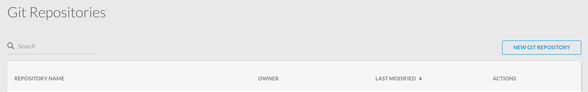
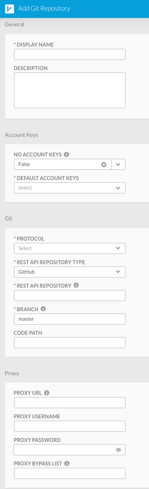

Working with Git
================

Git is able to be used to import/export all workflows and atomic actions.

.. youtube:: mV2_zrAoovQ

Exporting to Git
----------------

In the workflow workspace you can select a git repository to commit to.

1. Use the "Commit" button at the top of the page.

.. image:: _static/specificrun.png
    :target: _static/specificrun.html
    :width: 700px
    :align: center
    :height: 50px

2. Provide a file name and a commit message.

3. Use the load new version button to switch to any version of the workflow saved on Git.

Importing from Git
------------------

1. Go to "My Workflows".

2. Select the import button and choose a Git repository, filename, and version to import a workflow.

.. image:: _static/import.png
    :target: _static/import.html
    :width: 400px
    :align: center
    :height: 400px

Adding a Git Repository
-----------------------

1. Got to "Admin" and then "Git Repositories" to set up all the Git repositories.

2. To add a new repository click "New Git Repository".

3. Provide a name, description, and if you want to provides account keys.

4. Do Git setup by choosing what protocol to use, the Rest API repository type, the Rest API repository, the branch, and the code path.

5. Once everything is filled in click the "Submit" button.

