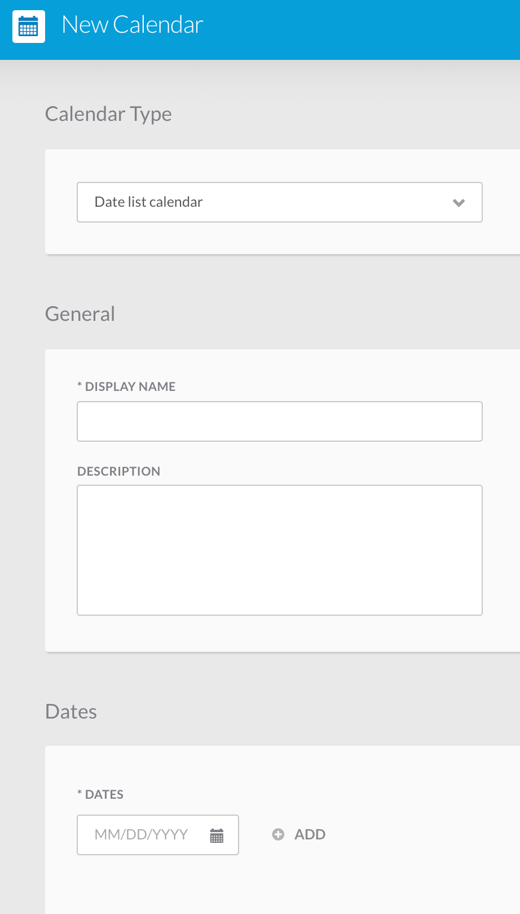
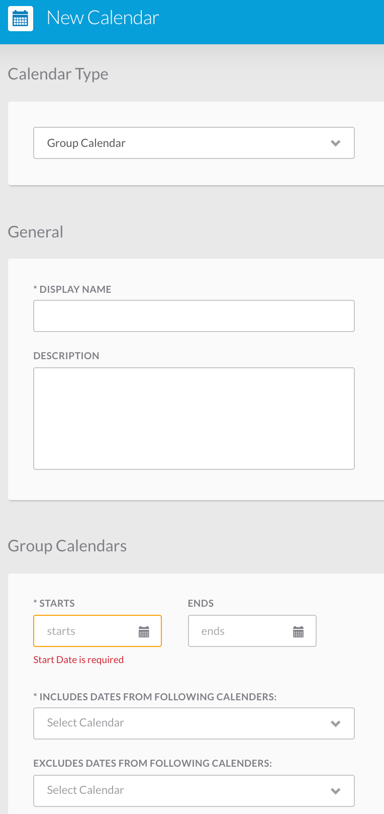
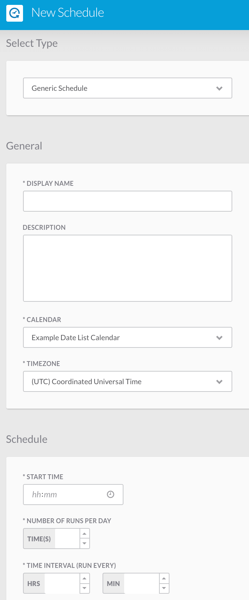
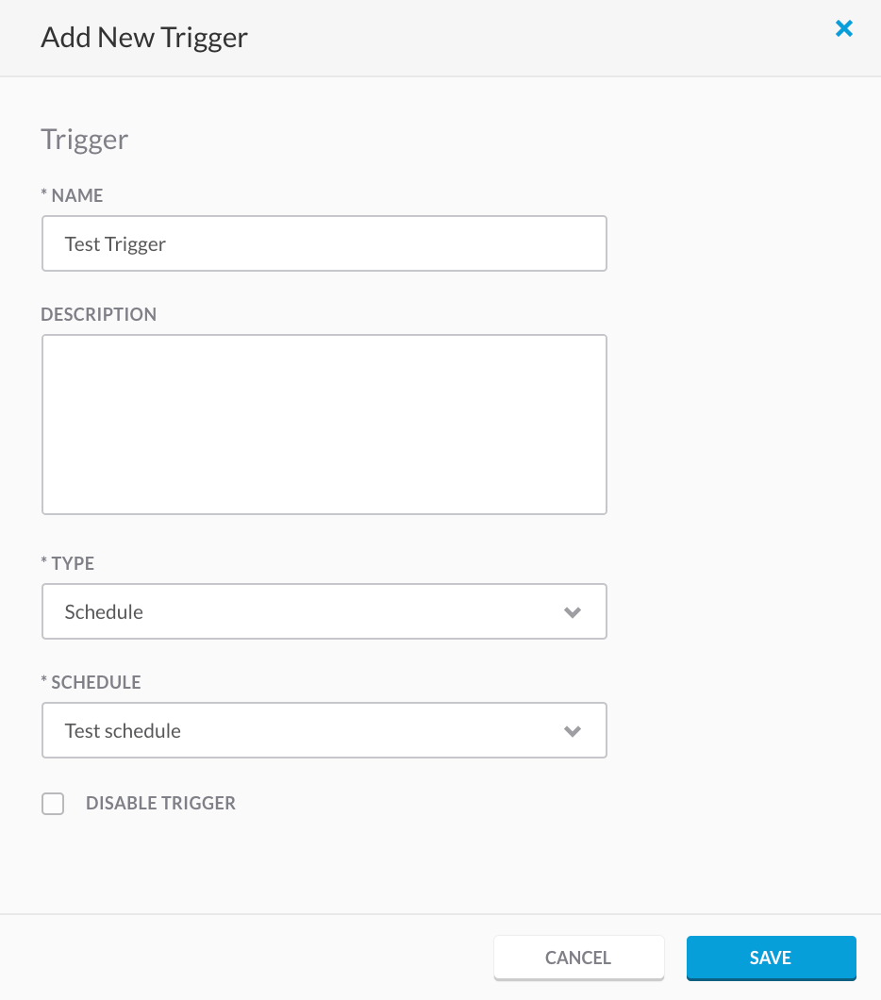

.. _schedules:

Schedules
=========

.. youtube:: K688WBVfaWk

Calendars
---------

Calendars allow you to choose specific days for a workflow to run.

There are three types of calendars including: date list calendars, group calendars, and a recurring calendars.

You will provide a name and a description for each calendar.

Date List Calendar
^^^^^^^^^^^^^^^^^^

1. Select Date List Calendar from the dropdown.

2. Provide a name and a description.

3. Add a list of single dates to have the triggers run on.

Group Calendar
^^^^^^^^^^^^^^

1. Select Group Calendar from the dropdown.

2. Provide a name and a description.

3. Choose a group of dates with a start and end date.

4. Choose to include or exclude dates from other calendars.

Recurring Calendar
^^^^^^^^^^^^^^^^^^

1. Select Recurring Calendar from the dropdown.

2. Provide a name and a description.

3. Choose a group of dates with a start and end date.

4. Choose to have it recur daily, weekly, monthly, or yearly.

.. image:: _static/recurring.png
    :target: _static/recurring.html
    :width: 300px
    :align: center
    :height: 500px

Schedules
---------

Schedules use the calendars to trigger workflows to run at specified dates and times.

1. Provide a display name, a description, the calendar name, and the timezone.

2. Decide a start time, the number of runs per day, and the time interval between runs.

Adding a Schedule to a Workflow
-------------------------------

1. Add a schedule to a workflow by going to the desired workflow and scrolling down to triggers.

2. Add a new trigger by providing a name, description, type, and the schedule that you created.

