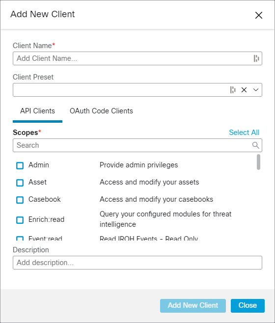
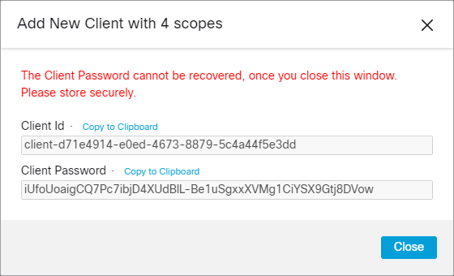

.. _api_client:

Getting Started
===============

Users can generate API client credentials, which can be used to access the Cisco SecureX threat response
APIs programmatically.

Refer to the `Cisco Threat Response API Client Documentation <https://visibility.amp.cisco
.com/help/integration>`_ for more info on how to create an API client.

Global API Endpoint URLs
------------------------

To find the correct API endpoint URL query  https://visibility.amp.cisco.com/clouds.json and present
the user with the name of the region. Then save it and use the appropriate URLs for the region.

The current available regional API endpoints are:

+--------------------------------+--------------------------------------------------------------------+
| Asia                           | https://visibility.apjc.amp.cisco.com                              |
+--------------------------------+--------------------------------------------------------------------+
| Europe                         | https://visibility.eu.amp.cisco.com                                |
+--------------------------------+--------------------------------------------------------------------+
| North America                  | https://visibility.amp.cisco.com                                   |
+--------------------------------+--------------------------------------------------------------------+

All examples in this documentation will use the North America region.

Create API Client in Threat Response UI
---------------------------------------

When creating your API client, you will receive a ``Client ID`` and ``Client Password`` which
will be used to retrieve an access token in the next step.

Generate new API Client Prompt

New API Client

Scopes
------

There are twenty-two scopes available when adding a new client. A single scope can be selected or any mix of the scopes can be chosen.

+--------------------------------+--------------------------------------------------------------------+
| Admin                          | Provide admin privileges                                           |
+--------------------------------+--------------------------------------------------------------------+
| Asset                          | Access and modify your assets                                      |
+--------------------------------+--------------------------------------------------------------------+
| Casebook                       | Access and modify your casebooks                                   |
+--------------------------------+--------------------------------------------------------------------+
| Enrich:read                    | Query your configured modules for threat intelligence (Read Only)  |
+--------------------------------+--------------------------------------------------------------------+
| Event:read                     | Read IROH Events (Read Only)                                       |
+--------------------------------+--------------------------------------------------------------------+
| Feedback                       | Submit Customer Feedback                                           |
+--------------------------------+--------------------------------------------------------------------+
| Global Intel:read              | Access AMP Global Intelligence (Read Only)                         |
+--------------------------------+--------------------------------------------------------------------+
| Inspect:read                   | Extract Observables and data from text                             |
+--------------------------------+--------------------------------------------------------------------+
| Integration                    | Manage your modules                                                |
+--------------------------------+--------------------------------------------------------------------+
| Investigation                  | Perform threat analysis investigation                              |
+--------------------------------+--------------------------------------------------------------------+
| Invite                         | Invite users into your organization                                |
+--------------------------------+--------------------------------------------------------------------+
| Notification                   | Receive notifications from integrations                            |
+--------------------------------+--------------------------------------------------------------------+
| Oauth                          | Manage OAuth2 Clients                                              |
+--------------------------------+--------------------------------------------------------------------+
| Orbital                        | Orbital Integration.                                               |
+--------------------------------+--------------------------------------------------------------------+
| Private Intel                  | Access Private Intelligence                                        |
+--------------------------------+--------------------------------------------------------------------+
| Profile                        | Get your profile information                                       |
+--------------------------------+--------------------------------------------------------------------+
| Registry                       | Manage registry entries                                            |
+--------------------------------+--------------------------------------------------------------------+
| Response                       | List and execute response actions using configured modules         |
+--------------------------------+--------------------------------------------------------------------+
| SSE                            | SSE Integration. Manage your Devices.                              |
+--------------------------------+--------------------------------------------------------------------+
| Telemetry:write                | Collect application data for analytics (Write Only)                |
+--------------------------------+--------------------------------------------------------------------+
| Users                          | Manage users of your organisation                                  |
+--------------------------------+--------------------------------------------------------------------+
| Webhook                        | Manage your Webhooks                                               |
+--------------------------------+--------------------------------------------------------------------+

The scopes can be selected when creating API Clients at https://securex.us.security.cisco.com/settings/apiClients

.. warning::

    Security access control best practice requires providing a user or service least access. When
    designing API workflows, it is often desirable to have more than one set of API client
    credentials for destructive and non destructive API operations. API clients can be created to
    have different combinations of scopes which can be used to map out and provide least access to
    different parts of a client application.

Using API Client Credentials to Get Access Token
------------------------------------------------

You cannot access the API directly using the ``Client ID`` and ``Client Password`` because Threat Response requires the
use of an ``Access Token``. You can request a token from the `OAuth2 Token Api <https://visibility.amp.cisco.com/iroh/oauth2/index.html#/OAuth2/post_iroh_oauth2_token>`_.

.. http:example::

    POST https://visibility.amp.cisco.com/iroh/oauth2/token HTTP/1.1
    Content-Type: application/json
    Accept: application/json

    {
        "client_id": "client-d71e4914-e0ed-4673-8879-5c4a44f5e3dd",
        "client_password": "iUfoUoaigCQ7Pc7ibjD4XUdBIL-Be1uSgxxXVMg1CiYSX9Gtj8DVow",
        "grant_type": "client_credentials"
    }

Example using Bash with a curl command:

.. code-block:: bash

    client_id: "client-d71e4914-e0ed-4673-8879-5c4a44f5e3dd"
    client_password: "iUfoUoaigCQ7Pc7ibjD4XUdBIL-Be1uSgxxXVMg1CiYSX9Gtj8DVow"
        curl -X POST \
         -u "$client_id:$client_password" \
         --header 'Content-Type: application/x-www-form-urlencoded' \
         --header 'Accept: application/json' \
         -d 'grant_type=client_credentials' \
         'https://visibility.amp.cisco.com/iroh/oauth2/token'

JSON Response:

.. code-block:: JSON

    {
      "access_token":"eyJhbGciO...",
      "token_type":"bearer",
      "expires_in":600,
      "scope":"enrich:read casebook inspect:read private-intel"
    }

Description of Response:

+-----------------+----------------------------------------------------------------------------------------------------------------------------------------------------------------------------------------------------------------+
| access_token    | Indicates what you pass in the authorization header                                                                                                                                                            |
+-----------------+----------------------------------------------------------------------------------------------------------------------------------------------------------------------------------------------------------------+
| token_type      | Indicates it should be presented as a certain type of token                                                                                                                                                    |
+-----------------+----------------------------------------------------------------------------------------------------------------------------------------------------------------------------------------------------------------+
| expires_in      | Indicates how many seconds this token is valid. You will need to request a new one after it expires, using the same API call                                                                                   |
+-----------------+----------------------------------------------------------------------------------------------------------------------------------------------------------------------------------------------------------------+
| scope           | Contains a list of scopes that were granted to this token. It may not include all of the scopes for which the client was authorized if your user identity has lost privileges since the API Client was created |
+-----------------+----------------------------------------------------------------------------------------------------------------------------------------------------------------------------------------------------------------+

Once an ``Access Token`` has been created, you can call the APIs you granted the API Client permissions to access. See documentation `here <https://visibility.amp.cisco.com/help/ctr-api>`_.

Authentication
--------------

All Threat Response APIs use an ``Access Token`` for authentication. This is an opaque value which is passed in as an HTTP header: ``Authorization: Bearer <Access Token>``.
``Access Tokens`` are short-lived, and can be requested or refreshed from the `OAuth2 Token Api <https://visibility.amp.cisco.com/iroh/oauth2/index.html#/OAuth2/post_iroh_oauth2_token>`_.

For more information please see: https://visibility.amp.cisco.com/help/integration

Rate Limits
-----------

To protect our infrastructure, we apply rate limits to API requests. The current limit is 8000 requests per rolling 60 minute window.
When you make a request, the X-Ratelimit-Org-Limit header will tell you the rate limit being applied.

.. Warning ::

    If you go over your rate limit, you will get a 429 Too Many Requests response code. When developing your integration with Cisco SecureX threat response, you should ensure the you are staying under the quota, as well as handling the HTTP 429 error gracefully and throttling your requests.

More information and examples of rate limits can be found at: https://visibility.amp.cisco.com/help/integration

APIs
-------------
There are six available APIs used for integrations. These include:

+-----------------------------------------------------------------------------------------------------+----------------------------------------------------------------------------------------------------------------------------------------+
| `Inspect <https://visibility.amp.cisco.com/iroh/iroh-inspect/index.html>`_                          | Parses a string of text and extracts supported observables                                                                             |
+-----------------------------------------------------------------------------------------------------+----------------------------------------------------------------------------------------------------------------------------------------+
| `Enrich <https://visibility.amp.cisco.com/iroh/iroh-enrich/index.html>`_                            | Manage users of your organization Used to get query for information about an observable or to pivot to a product UI                    |
+-----------------------------------------------------------------------------------------------------+----------------------------------------------------------------------------------------------------------------------------------------+
| `Response <https://visibility.amp.cisco.com/iroh/iroh-response/index.html>`_                        | Used to take action on an observable within a product                                                                                  |
+-----------------------------------------------------------------------------------------------------+----------------------------------------------------------------------------------------------------------------------------------------+
| `OAuth2 <https://visibility.amp.cisco.com/iroh/oauth2/index.html#/OAuth2/post_iroh_oauth2_token>`_  | Used to get a token                                                                                                                    |
+-----------------------------------------------------------------------------------------------------+----------------------------------------------------------------------------------------------------------------------------------------+
| `Global-Intel <https://intel.amp.cisco.com/index.html#/>`_                                          | Global instance of `CTIA <https://github.com/threatgrid/ctia>`_ only has read access                                                   |
+-----------------------------------------------------------------------------------------------------+----------------------------------------------------------------------------------------------------------------------------------------+
| `Private-Intel <https://private.intel.amp.cisco.com/index.html#/>`_                                 | Customer specific instance of `CTIA <https://github.com/threatgrid/ctia>`_ where Casebooks, Snapshots, Investigations, etc are stored  |
+-----------------------------------------------------------------------------------------------------+----------------------------------------------------------------------------------------------------------------------------------------+

More information can be found at: https://visibility.amp.cisco.com/help/integration
